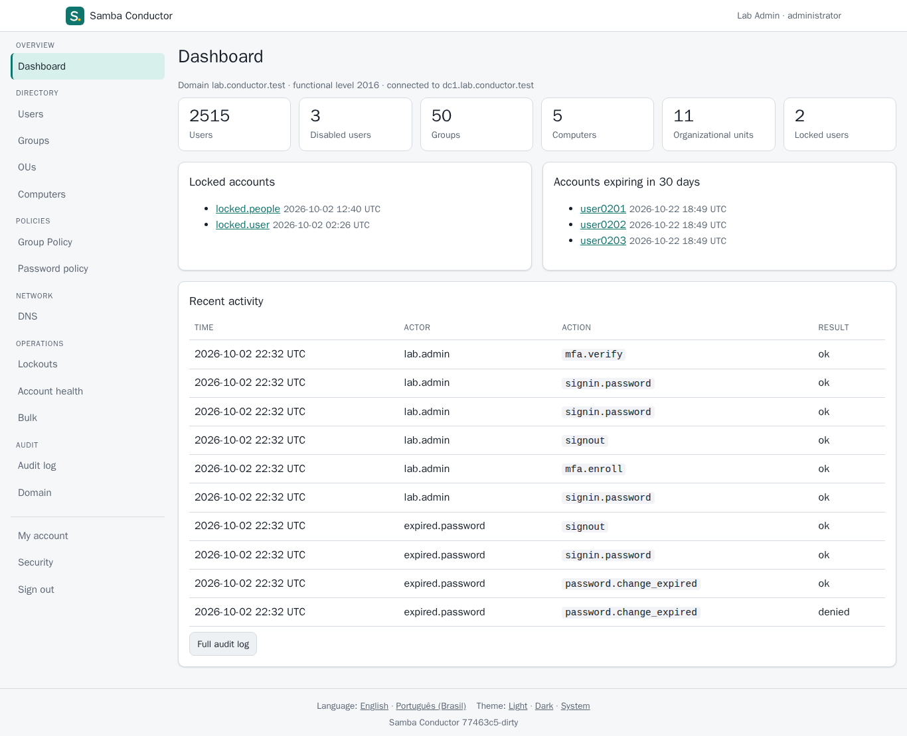
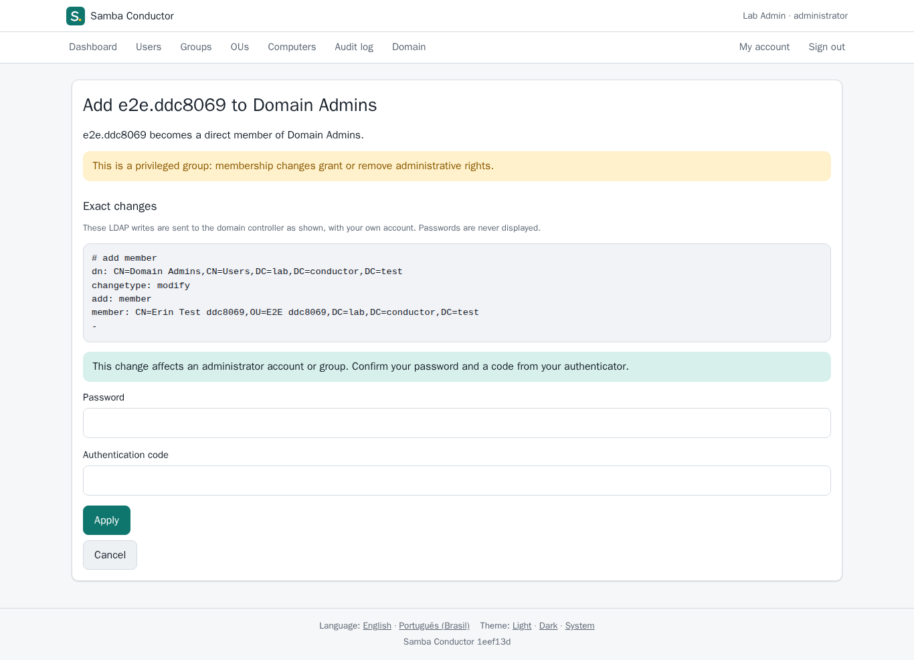

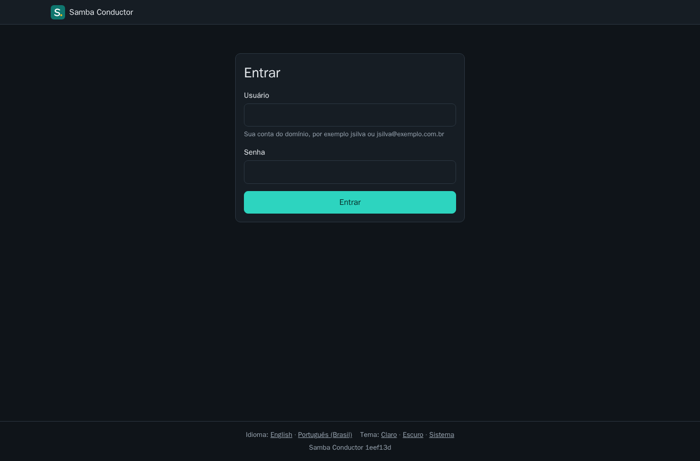
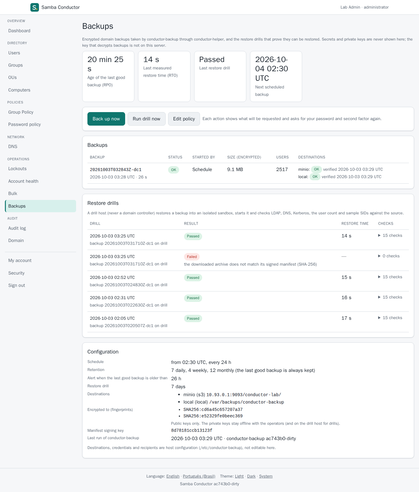
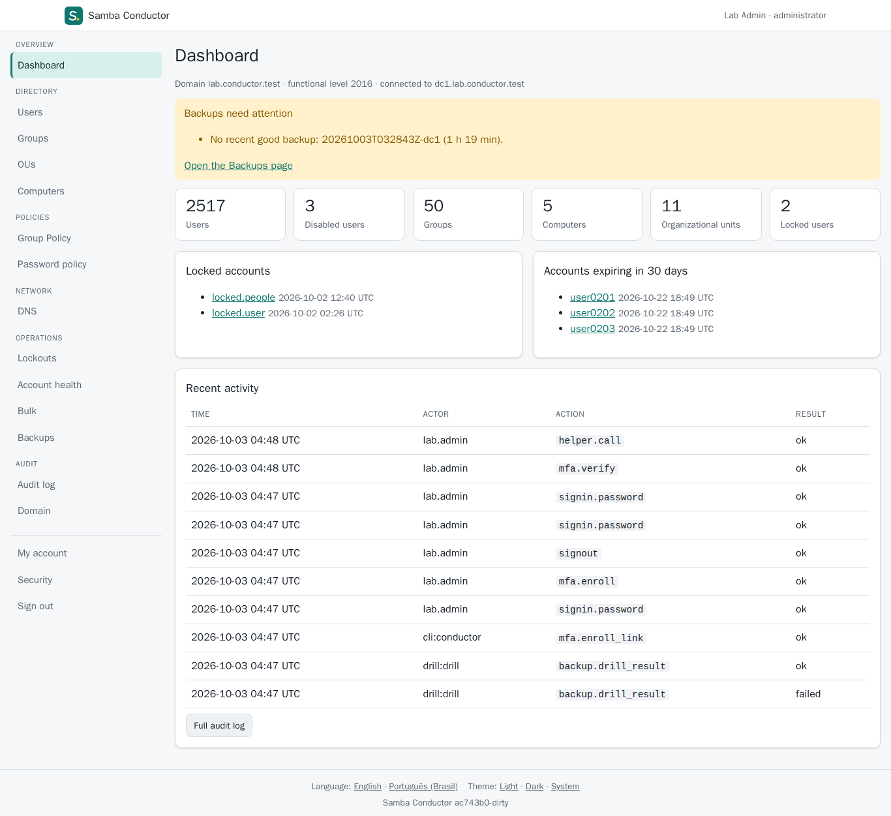

# conductor

Web administrator and self-service portal for Samba Active Directory
(`conductor`), plus the privileged local helper (`conductor-helper`). Part of
Samba Conductor v2. Design: [docs/design.md](docs/design.md) and the
family's [architecture.md](https://github.com/openbasalt/samba-conductor-docs/blob/main/architecture.md). The other
repositories: [samba-conductor-docs](https://github.com/openbasalt/samba-conductor-docs).

Container images: `docker.io/openbasalt/samba-conductor` and `samba-conductor-dc` (the DC, in preview), tags `0.1.1` and `latest`, also on `ghcr.io/openbasalt` with the same digests, see [containers.md](https://github.com/openbasalt/samba-conductor-docs/blob/main/containers.md).

Status: 0.1.1 released (signed GitHub release `v0.1.1`, APT packages
`0.1.1-1`, container images above). Users, groups, OUs, computers,
self-service, DNS, Group Policy links, password policies, lockouts across
DCs, account health, bulk operations, security keys, encrypted domain
backups with restore drills
([conductor-backup](https://github.com/openbasalt/samba-conductor-backup)),
file servers
([conductor-files](https://github.com/openbasalt/samba-conductor-files)) and
the Google Workspace sync section
([conductor-sync](https://github.com/openbasalt/samba-conductor-sync)) and
the Single sign-on section
([conductor-idp](https://github.com/openbasalt/samba-conductor-idp)).
Validated end to end in a two-DC lab, desktop and mobile, including a
full-forest restore: lab runs in [`docs/usage-p3.md`](docs/usage-p3.md),
[`docs/usage-p2.md`](docs/usage-p2.md), [`docs/usage-p1.md`](docs/usage-p1.md)
[`docs/usage-p5b.md`](docs/usage-p5b.md) and [`docs/usage-p4b.md`](docs/usage-p4b.md). Recovery runbook:
[`docs/restore.md`](docs/restore.md).

| | |
|---|---|
|  |  |
|  |  |
|  |  |

## What it does

- Sign-in with the user's own AD account: Kerberos through the `ad`
  library (LDAP simple bind only when configured). The ticket stays in
  memory for the session; no service account is used for anything the user
  does, so AD's own ACLs apply to every read and write.
- Every bind sub-code handled: an expired or must-change password (which
  AD proves right) leads to a change page that asks for the old password
  again; locked, disabled and expired accounts get a clear message;
  everything else is "wrong username or password".
- 2FA (TOTP + recovery codes): mandatory for administrators (and by
  default for helpdesk and auditors), `off` / `optional` / `required` for
  everyone else. Administrators without 2FA enroll only through a one-time
  link, so a stolen administrator password is not enough to register a
  device.
- Roles by AD group SID, re-checked against AD (tokenGroups) on every
  privileged request, cached at most 60 s:

  | Role | Group (configurable) | May |
  |---|---|---|
  | admin | Domain Admins (RID 512) | everything below |
  | helpdesk | e.g. `Helpdesk` | search/view users, reset password, unlock, enable/disable (where AD delegates it; never on privileged accounts) |
  | auditor | e.g. `Auditors` | read-only admin views, audit log, domain info |
  | everyone | | self-service |

- Administration: dashboard; users (server-side sorted search and
  pagination, create, edit, enable/disable, unlock, reset password, move,
  delete, group membership, 2FA reset and enrollment links); groups
  (members with paging, nesting, create, delete, add/remove members); OUs
  (tree, create, rename, move, delete when empty); computers (enable/
  disable, move, delete; domain controllers protected).
- Preview before every write: the exact LDAP changes (passwords
  redacted) are shown and applied only after confirmation; changes to
  administrator accounts and privileged groups need password + TOTP again.
- DNS: AD-integrated zones and records (A, AAAA, CNAME, MX, TXT,
  SRV, PTR, NS) over LDAP with the user's own credentials, paging and
  search, zone create/delete (forward and reverse); the AD zones and the
  records AD manages (locators, DC records, apex SOA/NS) are read-only, with
  DCs discovered from the directory, never configured by name.
- Group Policy: GPOs and where they are linked; link, unlink,
  enable/disable, enforce, link order, block inheritance; GPO create/delete
  through samba-tool with the user's Kerberos ticket. Settings inside a GPO
  stay with RSAT/GPMC.
- Password policy: domain policy (warns when lockout is off),
  fine-grained policies (PSOs) and their targets, the effective policy of a
  user.
- Lockouts and account health: lockout state and bad-password
  counters from every DC, expiring/expired passwords, never signed in,
  stale, disabled, CSV export, actions on selected accounts.
- Bulk: CSV import (create, update) with a strict template, every
  row validated before anything is written, the full preview, a background
  apply with a per-row audit and report, retry of failed rows; generated
  passwords shown once and downloadable.
- Security keys: WebAuthn keys and platform authenticators next to
  TOTP (register, name, remove; sign-in and re-authentication); optionally
  mandatory for administrators.
- Backups: the Backups page (administrators; auditors read-only)
  shows conductor-backup's encrypted backups per destination with their
  verification, the restore drills with their checks and measured restore
  time, RPO and RTO, the policy, destinations and recipients'
  fingerprints (never a secret); "Back up now", "Run drill now" and policy
  changes are previewed and need re-authentication. A dashboard banner
  warns when the last good backup is too old, a backup or drill failed, or
  conductor-backup stopped running. Results are recorded in conductor's
  state and audit log.
- Google Workspace sync (administrators only, `[sync]` on):
  conductor-sync's settings, key, plans and applies from the browser
  through its local management API: a setup wizard (service account key,
  connection test, who is synced by OU and by include/exclude groups, org
  units by group with priorities and by OU, e-mail templates previewed
  against real AD users, safety limits), plans grouped by kind with the
  limits and plan errors, applies bound to the reviewed plan by a typed
  confirmation and the digest, blocked scheduled runs and their override,
  history and the settings' version history. Every change is previewed,
  re-authenticated and audited here and in conductor-sync.
  A one-time "Import from Google" creates the AD users and groups of a
  company that already uses Google Workspace (read-only on Google, a
  previewed bulk job on AD), so the sync then adopts the existing accounts.
- Single sign-on (administrators only, `[idp]` on): conductor-idp's
  OpenID Connect clients and SAML service providers (guided presets for
  Google Workspace, Grafana, Nextcloud and GitLab, SAML metadata import,
  allowed AD groups picked by SID, a claims or assertion preview for a
  real user, single logout endpoints), signing keys with staged rotation
  and certificate download, session lifetimes and the consent note, and
  sign-in activity per application with conductor-idp's audit log. Every
  change is previewed, re-authenticated and audited here and in
  conductor-idp; a client secret is shown once.
- One second factor for conductor and conductor-idp (`[idp] mfa_socket`):
  conductor serves its enrollments (TOTP, recovery codes, security keys)
  and its policy to conductor-idp on a local socket.
- Self-service: profile, edit of the attributes Samba lets users write
  on themselves (phones, office, address, web page), password change,
  2FA, sessions and "sign out everywhere". With the sync on, "Connected
  accounts": the user's own account on each target conductor-sync
  provisions to, activated on demand and given a new password (generated
  and shown once, or typed), with a recent second factor; never stored.
- Audit log: append-only SQLite table (triggers refuse updates and
  deletes) with a hash chain; viewer with filters, JSON lines export,
  `conductor audit verify`. The chain detects accidental or partial edits.
  It is not keyed or anchored outside the database, so it does not protect
  against someone with write access to the database file. Protect the
  database file and ship the exported log off the host if you need tamper
  evidence.
- conductor-helper: the only root process, on a Unix socket only the
  `conductor` user may use (SO_PEERCRED): read-only domain information
  (functional levels, FSMO roles, DCs) and, with backups configured
  (`/etc/conductor/helper.toml`), the backup status, requests and policy;
  a second socket admits only conductor-backup, for the online backup it
  encrypts before writing anything. Every call logged and audited.

## Security notes

- No JavaScript except one small self-hosted script on the second-factor
  pages (WebAuthn needs the browser API), loaded with a per-response CSP
  nonce and Subresource Integrity and making no requests of its own; every
  other page has CSP `script-src 'none'`. Styles and images from the same
  origin only, `frame-ancestors 'none'`, HSTS, `Referrer-Policy:
  no-referrer`.
- CSRF token on every POST plus Fetch-metadata/Origin checks; the sign-in
  form uses a double-submit pre-session cookie.
- Session cookie `__Host-conductor` (HttpOnly, Secure, SameSite=Strict),
  server-side sessions, idle 15 min, absolute 8 h, new ID after 2FA.
- Rate limits per client address and per account on sign-in, 2FA and
  password pages; the per-account limit stops before AD would lock the
  account.
- Errors never show LDAP or samba-tool output; details go to the journal
  without secrets.
- TOTP secrets sealed with AES-256-GCM under a key from systemd credentials,
  bound to the user's SID; replayed codes are refused.
- systemd sandboxing: `conductor` runs with no capabilities and
  `ProtectSystem=strict`; the helper keeps only the file capabilities it
  needs and no network beyond localhost.

## Documentation

- [Install (Debian 13 / Ubuntu 26.04)](docs/install.md)
- [Install on Basalt OS / Fedora (RPM, SELinux)](docs/install-fedora.md)
- Packaging, releases, CI: [packaging.md](https://github.com/openbasalt/samba-conductor-docs/blob/main/packaging.md); package files in [`packaging/`](packaging/)
- [Configuration reference](docs/config.md)
- [Restore runbook](docs/restore.md)
- [Design](docs/design.md)
- Lab runs: [Single sign-on section](docs/usage-p4b.md), [Google Workspace sync section](docs/usage-p5b.md), [backups, drills, restore exercise](docs/usage-p3.md), [DNS, Group Policy, policies, bulk](docs/usage-p2.md), [core administration and self-service](docs/usage-p1.md) and [screenshots](docs/screenshots/)

## Development

```sh
make check       # gofmt, go vet, staticcheck, govulncheck, go test -race
make build       # bin/conductor, bin/conductor-helper (CGO off, static)
make package     # dist/: the conductor .deb for amd64 and arm64, SBOMs
make lintian     # Debian 13's lintian on dist/*.deb
scripts/lab-deploy.sh [--snapshot]   # build on the lab host, install on the lab's dc1
e2e/run-lab.sh [--no-deploy] [desktop|mobile]   # Playwright suite on the lab host
```

The module is `github.com/openbasalt/samba-conductor`. It imports the `ad`
library (`github.com/openbasalt/samba-conductor-ad`), conductor-sync's API
protocol (package `syncapi`) and conductor-files' agent protocol (package
`filesapi`) at the versions `go.mod` pins; a Go workspace builds against
local copies instead ([CONTRIBUTING.md](CONTRIBUTING.md)). Layout:

| Path | What |
|---|---|
| `cmd/conductor` | `serve`, `setup`, `enroll-link`, `audit verify|export`, `version` |
| `cmd/conductor-helper` | the privileged helper |
| `internal/web` | HTTP server, routes and guard, sessions, pages, templates, CSS |
| `internal/store` | SQLite state, embedded migrations, audit hash chain |
| `internal/directory` | sign-in and connections through `ad` |
| `internal/totp`, `internal/secret` | RFC 6238, recovery codes, AES-GCM sealing |
| `internal/i18n` | message catalogs (`en`, `pt-BR`) |
| `internal/helperd` | helper socket server; backup operations (`backup.go`) |
| `deploy/systemd` | units |
| `e2e` | Playwright suite |

License: Apache-2.0 ([LICENSE](LICENSE), [NOTICE](NOTICE)).
