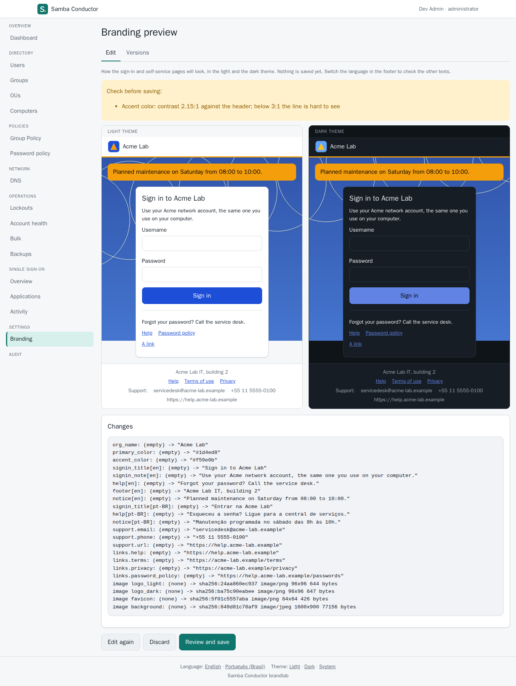
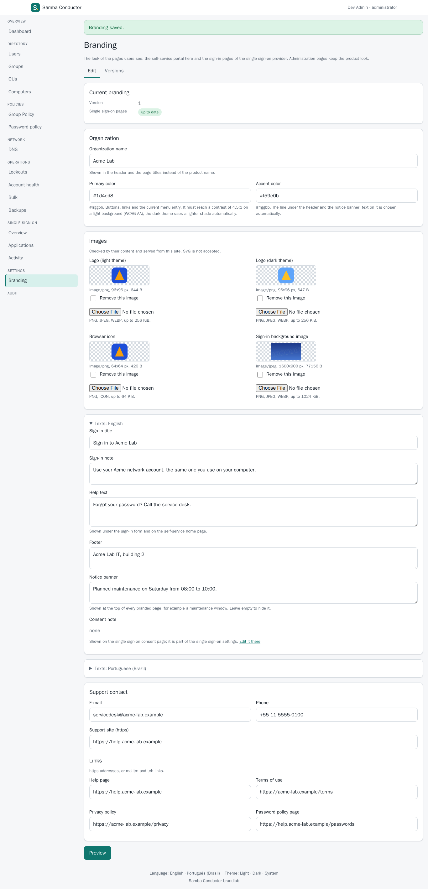
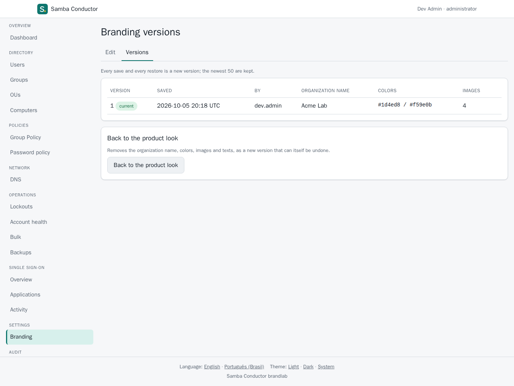
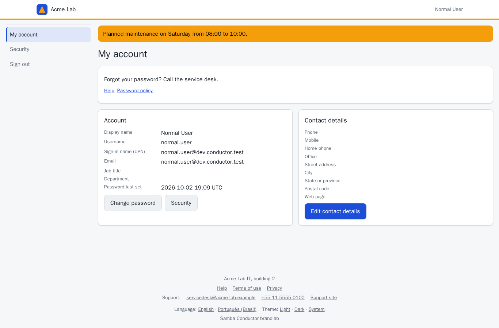
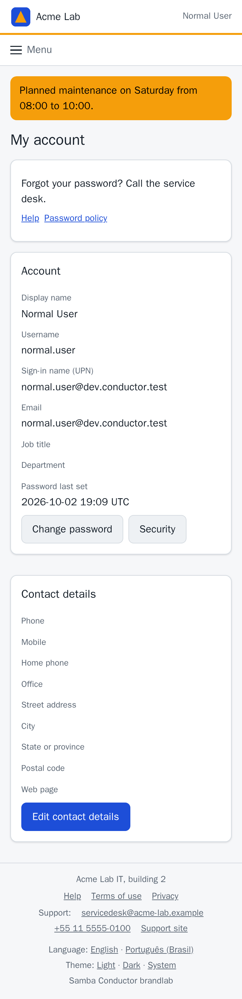

# Branding

The pages users see can carry the organization's look: conductor's
self-service portal (`/me` and the pages below it) and, when the
"Single sign-on" section is enabled, conductor-idp's sign-in, second
factor, consent and logout pages. One branding for both, so a user going
from an application to the sign-in page and to the self-service portal
stays in one visual identity. The admin pages keep the product look.

Two levels:

- Level 1, Settings > Branding in the admin UI (administrators only):
  organization name, logos, favicon, colors, texts, support contact and
  links. Stored in conductor's database, versioned, pushed to
  conductor-idp.
- Level 2, files on the server: template overrides of a few named
  partials, for what level 1 cannot express.

## Level 1: Settings > Branding

| Field | Where it shows |
|---|---|
| Organization name | header and page titles, instead of the product name |
| Logo (light theme), logo (dark theme) | header; the dark one in the dark theme (default: the light one) |
| Browser icon | favicon |
| Sign-in background image | conductor-idp's sign-in pages |
| Primary color | buttons, links, the current menu entry; a lighter shade in the dark theme |
| Accent color | the line under the header and the notice banner |
| Sign-in title and note (per language) | conductor-idp's sign-in page |
| Help text (per language) | under the sign-in form and on the self-service home |
| Footer (per language) | every branded page |
| Notice banner (per language) | the top of every branded page, for example a maintenance window |
| Support e-mail, phone, site | footer |
| Help, terms, privacy, password policy links | footer, sign-in page, password change pages |

The consent screen note of conductor-idp is a single sign-on setting
(Single sign-on > Policy); the Branding page shows it with a link there.

Limits and checks (the same code runs in conductor and conductor-idp):

- Images: PNG, JPEG or WebP; PNG or ICO for the browser icon. Logos up to
  256 KiB and 2048 pixels a side, the icon 64 KiB and 256 pixels, the
  background 1 MiB and 4096 pixels. The type is taken from the content,
  never from the file name. SVG is refused: it is a document that can
  carry scripts and links.
- Colors: `#rrggbb`. The primary color must reach a contrast of 4.5:1 on
  the light background (WCAG AA), or the edit is refused with the measured
  ratio; text on brand colors is white or black, whichever contrasts more.
  An accent color below 3:1 against the header is a warning shown in the
  preview.
- Links: https addresses, `mailto:` or `tel:`. Support site: https.
- Texts: name 100 characters, sign-in title 120, sign-in note 1000, help
  2000, footer and notice 500; no control characters; line breaks are
  kept, nothing is interpreted as markup.
- Texts fall back per field to English, then to the other language.

The flow:

1. Edit the form and choose "Preview". Nothing is saved yet: the edit
   becomes a draft in the session, with its images.
2. The preview shows the sign-in page in the light and the dark theme,
   the warnings and the list of changes. Switch the language in the footer
   to check the other texts. "Edit again" goes back to the form with the
   draft.

   

3. "Review and save" opens the usual confirmation: the change list, then
   the password and a code from the authenticator app (or a security key).
   The branding becomes a new version at once and is sent to
   conductor-idp. If conductor-idp cannot be reached, the version stays
   saved and the Branding page offers "Send to the sign-in pages again".

   

4. Versions lists the kept versions (the newest 50). "Restore" makes an
   older one current again and "Back to the product look" removes the
   branding; both create a new version and need the same confirmation, so
   they can be undone too.

   

Saving on top of a version that changed since the edit started is
refused. Every step is in the audit log: refused edits
(`branding.draft`), saves and restores (`branding.save`,
`branding.revert`, with the change list), the version created
(`branding.version`) and every push to conductor-idp (`branding.push`).
conductor-idp records the update in its own audit chain too.

The self-service portal, on a desktop and at 375 pixels:





conductor-idp's sign-in page:
[screenshots in its repository](https://github.com/openbasalt/samba-conductor-idp/blob/main/docs/branding.md).

How it is served: the colors are CSS custom properties in a generated
stylesheet (`/branding/theme.css`, versioned by its hash) and the images
are served from `/branding/assets/<sha256>` with their checked type. Both
are on this origin, so the Content Security Policy does not change: no
inline style, no script.

## Level 2: template overrides

`[branding] templates_dir` (for example `/etc/conductor/templates`)
names a directory whose files replace built-in partials of the
self-service pages. conductor-idp has the same mechanism for its pages
(its `[branding] templates_dir`,
[branding.md](https://github.com/openbasalt/samba-conductor-idp/blob/main/docs/branding.md)).

| File | Partial | Contract (must stay in the rendered output) |
|---|---|---|
| `header.html` | `brand-header` | `data-e2e="nav-link-home"` linking to `/`, and the signed-in user's name (`data-e2e="nav-text-user"`) |
| `footer.html` | `brand-footer` | the language and theme links (`footer-link-lang-en`, `footer-link-lang-pt-br`, `footer-link-theme-light`, `-dark`, `-system`) |
| `self-home.html` | `self-home` | the self-service home: the username (`me-text-sam`) and the links to `/me/password`, `/me/security` and `/me/edit` (`me-link-password`, `me-link-security`, `me-link-edit`) |
| `custom.css` | | an optional stylesheet loaded after the generated one |

Start from the built-in partial: `conductor templates show self-home`
prints it with a header line that records the hash of the built-in body:

```
{{/* samba-conductor template self-home.html base=4424326f91eec576 */}}
```

`conductor templates list` prints every partial with its hash and
contract. `conductor templates check` checks the directory of the
configuration: it reports refused overrides and overrides written against
a built-in partial that changed since (run it after every upgrade), and
exits with an error in both cases. The same findings are logged at
startup.

Rules:

- A file is a template body: Go html/template with auto-escaping and the
  functions of the built-in pages (`t` for translated messages, `e2e`,
  `time`). `{{define}}` and `{{block}}` are refused.
- Refused (the built-in partial stays, with a warning): `<script>`,
  embedded documents, `<base>`, `<link>`, `<meta>`, `<style>`, `style`
  attributes, event handler attributes, `javascript:`, `vbscript:` and
  `data:` URLs, the script nonce, forms that post to another site, a
  broken contract, an image without `alt`, an image from another origin
  that is not allowlisted, a file over 64 KiB, a file that does not parse
  or does not render with sample data.
- `custom.css` may not use `@import`, `expression()`, script URLs or
  `data:` URLs; its `url()` references stay on this origin or an
  allowlisted one.
- Images and fonts from another origin need it in
  `[branding] allowed_origins`, added to `img-src` and `font-src` of the
  branded pages only.
- An override that fails on a real page is replaced by the built-in
  partial for that response, with a warning in the log.
- Admin pages always use the built-in partials.
- The files are read at startup: restart conductor after a change.

The data a partial sees: `.Lang`, `.User` (`.Name`, `.SAM`, `.Roles`),
`.Nav`, `.CSRF`, `.Path`, `.Query`, `.Version`, `.D` (the page's own data;
on the self-service home `.D.U` is the user's entry and `.D.Fields` the
contact fields) and `.B`, the branding:

| Field | Content |
|---|---|
| `.B.Name` | organization name (the product name when none is set) |
| `.B.LogoLight`, `.B.LogoDark` | image URLs (empty: no logo) |
| `.B.Favicon`, `.B.FaviconType` | favicon URL and type |
| `.B.SignInTitle`, `.B.SignInNote`, `.B.Help`, `.B.Footer`, `.B.Notice` | texts in the page's language |
| `.B.SupportEmail`, `.B.SupportMailto`, `.B.SupportPhone`, `.B.SupportTel`, `.B.SupportURL` | support contact and its links |
| `.B.HelpURL`, `.B.TermsURL`, `.B.PrivacyURL`, `.B.PolicyURL` | links (https, mailto: or tel:) |
| `.B.HasSupport`, `.B.HasLinks` | whether those blocks have content |
