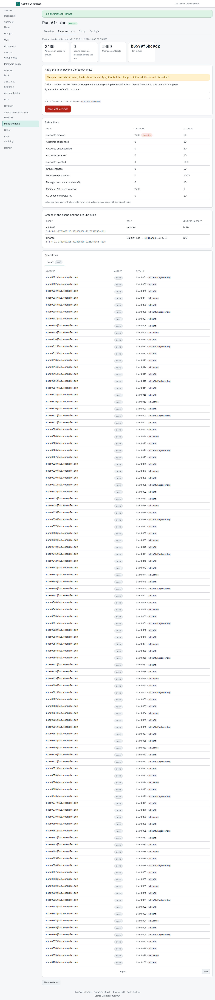
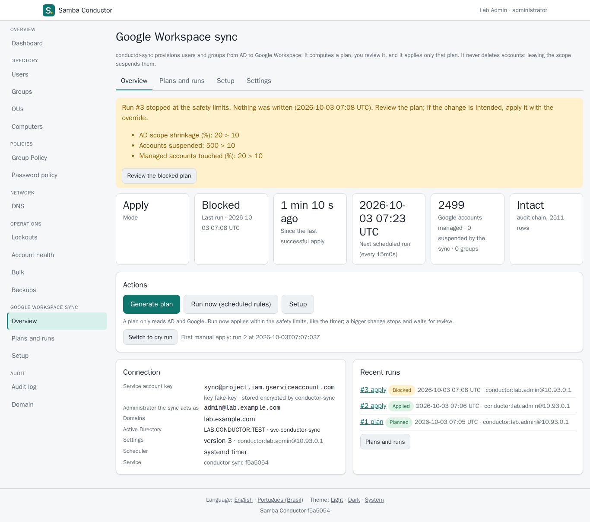
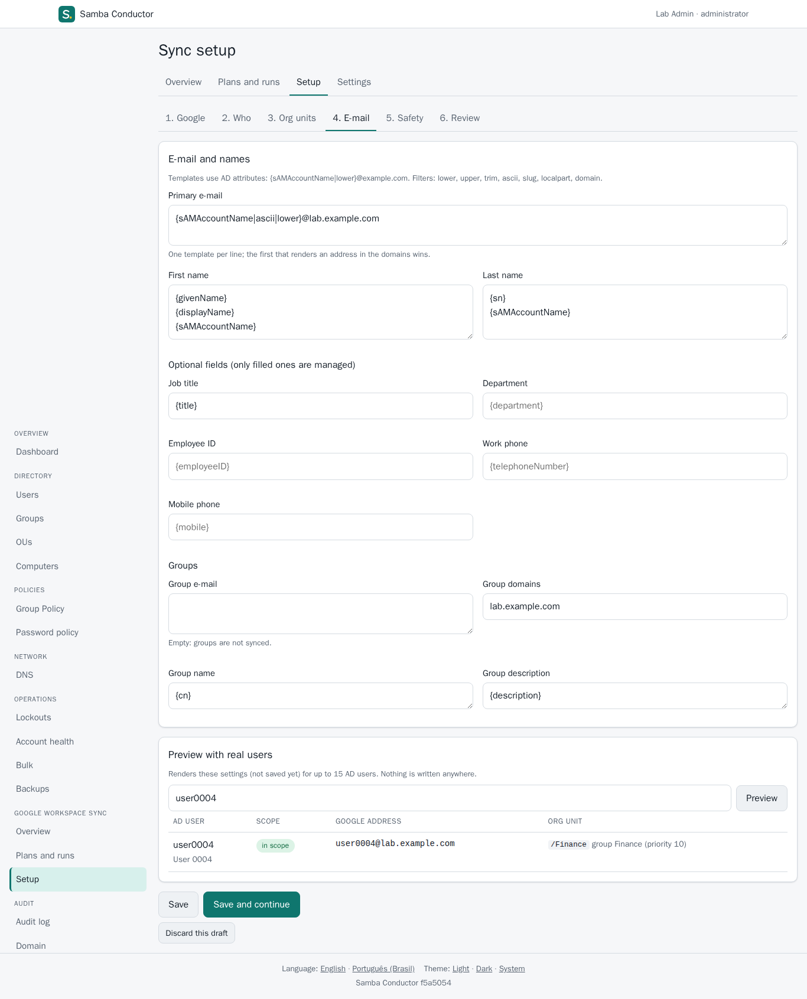
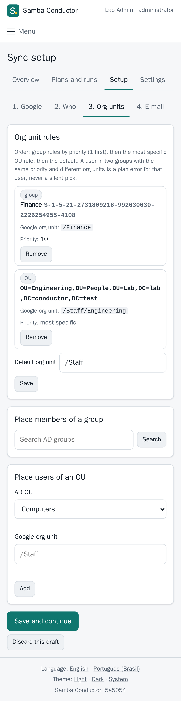

# P5b: the Google Workspace sync section

conductor's "Google Workspace sync" section lets administrators set up and
run conductor-sync (AD to Google Workspace provisioning, P5) from the
browser: the service account key, who is synced (OUs, include and exclude
groups), where users go in Google (org units by group, with priorities, and
by OU), the e-mail templates (previewed against real AD users), the safety
limits, then plans, applies, blocked runs and their override, and the
history.

Spec: `../../planning/docs/p5b-spec.md`. conductor-sync side (scope and
placement by group, the management API, the key at rest):
`../../conductor-sync/docs/usage-p5.md` §13, `mapping.md` and
`decisions.md` 28-37.

## How it works

```
browser --HTTPS--> conductor (user conductor) --Unix socket--> conductor-sync serve (user conductor-sync)
                    session, roles, 2FA          SO_PEERCRED:                reads AD (svc account, read-only)
                    previews, audit              conductor only              writes Google (service account)
```

- conductor never talks to Google and never holds the Google key after the
  upload: it calls conductor-sync's local management API (package
  `conductor-sync/syncapi`) as the signed-in administrator. conductor-sync
  checks the peer of every connection (SO_PEERCRED, the conductor user
  only) and writes every change to its own hash-chained audit log with that
  administrator (`conductor:<user>@<ip>`); conductor audits the same actions
  in its log.
- **Administrators only** (`sync.read`, `sync.write`; auditors and helpdesk
  see nothing). Every change asks for the password and a fresh second factor
  on a preview page: the key, saving the settings, the mode switch, an
  apply, an override, "run now". Generating a plan reads AD and Google only
  and needs no re-authentication (it is audited).
- An apply is bound to the reviewed plan twice: the administrator types the
  confirmation shown (`apply 1a2b3c4d`, or `override 1a2b3c4d` when the plan
  is beyond the safety limits: the first 8 characters of the plan's
  digest), and conductor-sync re-plans and applies only if the fresh plan has
  that digest.
- Plans and applies run in the background inside `conductor-sync serve`;
  the job page refreshes itself (an HTML refresh, no script) and lands on the
  run page.
- The key is sent once, stored encrypted by conductor-sync (AES-256-GCM,
  key from its `state-key` credential) and never shown again: pages show its
  client e-mail and key ID only. conductor never logs or audits it.
- No new script source: the pages use no JavaScript; the CSP is unchanged.

## Enabling it

On the host (the DC's VM, next to conductor):

1. Install conductor-sync as `../../conductor-sync/docs/usage-p5.md`
   describes (§§ 2-3), including the state key and the units
   `conductor-sync-api.socket` and `conductor-sync-api.service`:
   `systemctl enable --now conductor-sync-api.socket`.
2. In `/etc/conductor/conductor.toml`:

   ```toml
   [sync]
   enabled = true
   socket = "/run/conductor-sync/api.sock"
   ```

   and `systemctl restart conductor`. The socket is
   `conductor-sync:conductor 0660`.

The key, the scope, the mapping and the limits are then set in the browser.
Scheduled runs stay with `conductor-sync.timer`; enable it after the first
manual apply (`usage-p5.md` §6).

## The pages

| Page | What |
|---|---|
| Overview (`/admin/sync`) | mode, last run, time since the last successful apply, next scheduled run, managed accounts and groups, audit chain; blocked runs with a link to review them; actions: generate a plan, run now (scheduled rules), mode switch; key, admin subject, domains, settings version, scheduler; recent runs |
| Setup (`/admin/sync/setup`) | a wizard on a draft kept in the session (nothing is stored until the review is confirmed): 1 Google (key upload, admin subject, domains, connection test), 2 Who (OUs searched for users and left out, include and exclude groups from a directory search, groups synced to Google), 3 Org units (group rules with priorities, OU rules, default; the resolution order is explained on the page), 4 E-mail (templates, optional fields, groups; preview with real AD users, in or out of scope and why), 5 Safety (limits, policy, schedule interval), 6 Review (conductor-sync validates the draft and lists every changed setting; save with re-authentication) |
| Plans and runs (`/admin/sync/runs`) | every plan and apply, filter by status |
| Run (`/admin/sync/runs/{id}`) | the plan grouped by kind (create, update, rename, suspend, unsuspend, groups, memberships, local links) and paged, each operation with its details and reason (`org unit from group Finance (priority 10)`), the limits table, plan errors (users left untouched), warnings, skipped AD objects, the resolved groups with their current names and member counts; for an apply, each operation's result and a "failures" tab; the apply form when the plan is the latest and the mode is apply |
| Settings (`/admin/sync/config`) | the settings in force, a summary of the connection and the secrets, the host settings (file only), the version history (who, when, comment, each changed setting) with "Roll back to this version", and a TOML export |
| Settings > Connection (`/admin/sync/config/connection`, P5c) | how conductor-sync reaches AD and Google, the alert webhook, the secrets (write only) and the ownership marker; see below |
| Rollback (`/admin/sync/config/rollback?version=N`, P5c) | what restoring version N changes, the typed confirmation when it changes the marker; saved as a new version with re-authentication |
| Dashboard | a card with the last run, the mode, the next run and any blocked run |

## Connection settings and secrets (P5c)

Owner decision 2026-10-03: the settings that were file-only in P5b are
edited on Google Workspace sync > Settings > Connection. conductor-sync side:
`../../conductor-sync/docs/usage-p5.md` §14 and `decisions.md` 38-43.

- **Active Directory**: realm, DCs, preferred DCs, DNS servers, the bind
  account and the authentication (Kerberos or simple bind over TLS), the
  domain CA pinned for LDAPS (pasted or uploaded PEM, shown as subject,
  expiry and SHA-256; "use the host's CA file" goes back to the file).
  **Google**: admin subject, customer, requests per second, retries,
  timeout. **Alerts**: the webhook URL.
- Edits are a draft in the session (shown with every changed setting).
  "Test connection" signs in to AD and reads the admin subject on Google
  with exactly the draft; "Review and save" is refused until a test of the
  current draft passed for the part that changed (AD, Google or both). The
  preview lists every changed setting (the CA as a count and a short hash)
  and warns that AD settings decide where the bind credentials go; saving
  needs the password and a fresh second factor. conductor-sync signs in to
  AD again before it stores an AD change.
- **Secrets** (AD bind password, Google service account key, webhook HMAC
  secret): a table with the state only (configured or not, stored encrypted
  by conductor-sync or from the credential file named in the configuration,
  when and by whom), "Replace" and, for a stored one, "Remove" (with a
  warning: the credential file, if any, is used again). A new bind password
  is tested against AD before it is proposed and again by conductor-sync
  before it is stored. A new bind account and its password can also be
  saved together from the AD card. Values are never shown, logged or
  audited: previews and audit lines name the secret only.
- **Ownership marker**: its own card, a warning (accounts marked with the
  current value are orphaned), the typed confirmation
  `change marker to <new marker>`, then the preview with the warning and
  re-authentication. conductor-sync checks the typed text too.
- **Rollback**: from the history; the page lists what changes back and
  says that secrets are not versioned.
- Administrators only (`sync.read` / `sync.write`); auditors and helpdesk
  get 403 on every page and action. No new script source; the forms work
  without JavaScript; the CSP is unchanged.

## Lab run (2026-10-03)

In the lab (`../../planning/docs/lab.md`, snapshot
`conductor-p5b`: two Samba 4.22 DCs, 2,517 users; conductor-sync on dc1
behind its socket-activated API; the fake Google Directory API on dc1's
loopback, no real Google involved). `e2e/run-lab.sh` runs the whole
Playwright suite on a freshly reset lab per project: **42 passed, 1 skipped
(the opt-in missed-schedule check), desktop and mobile**, the audit chain
verified after each project. `tests/17-sync.spec.ts`, as `lab.admin`:

1. **Setup**: the fake's key uploaded (the preview names its e-mail and key
   ID; the page never contains the key) with re-authentication; admin
   subject and domain; connection test (AD: dc1 as `svc-conductor-sync`;
   Google: token issued, admin subject found); scope = members of `All
   Staff` (picked from a directory search, stored by SID); `Finance` ->
   `/Finance` (group rule, priority 10) and `Lab / People / Engineering` ->
   `/Staff/Engineering` (OU rule); the job title mapped; the preview shows
   `user0004@lab.example.com` in `/Finance` "group Finance (priority 10)";
   review lists the changed settings; saved with re-authentication; the
   settings page shows version 1 by `conductor:lab.admin`.
2. **First apply**: mode switched to apply (re-authentication); "Generate
   plan" (about 11 s for 2,499 users): 2,499 creates, `max_creates`
   exceeded, the groups table with names and members; a wrong typed
   confirmation (`apply …` instead of `override …`) is refused; the right
   one plus re-authentication starts the job; 2,499 accounts created in
   about 52 s; run page "Applied", 0 failed.
3. **Blocked run and override**: `Support` excluded (a new settings
   version); "Run now" with the scheduled rules: blocked (500 suspensions >
   10, 20 % touched > 10 %, 20 % scope shrinkage > 10 %), nothing written;
   the overview and the dashboard show it; the override (typed
   confirmation, re-authentication) suspends the 500 accounts in about
   10 s; the history filter shows the one blocked run.
4. **Access**: auditors and helpdesk get 403 on every sync page and action
   and no navigation entry.

conductor-sync's own log after a run (dc1):

```
RUN  ACTION  TRIGGER    STATUS   OPS   DONE  FAILED  ACTOR                          NOTE
4    apply   manual     applied  500   500   0       conductor:lab.admin@10.93.0.1  safety limits overridden by the operator
3    apply   scheduled  blocked  500   0     0       conductor:lab.admin@10.93.0.1  max_source_drop_percent: 20 exceeds 10; max_suspends: 500 ...
2    apply   manual     applied  2499  2499  0       conductor:lab.admin@10.93.0.1  safety limits overridden by the operator
1    plan    manual     planned  2499  0     0       conductor:lab.admin@10.93.0.1
intact: 3015 rows
VERSION  ACTOR                          ORIGIN  CHANGES
3        conductor:lab.admin@10.93.0.1  api     1
2        conductor:lab.admin@10.93.0.1  api     1
1        conductor:lab.admin@10.93.0.1  api     3
```

Unit tests (`internal/web/sync_test.go`) cover the same flows against a fake
API client: access by role, the typed confirmation and the digest, the
re-authentication before every change, the key upload never reaching a page
or the audit log, the draft and the saved settings, job pages, the export.

Screenshots (`docs/screenshots/{desktop,mobile}/`): `17-sync-unconfigured`,
`17-sync-key-confirm`, `17-sync-setup-google`, `17-sync-setup-scope`,
`17-sync-setup-mapping`, `17-sync-setup-preview`, `17-sync-setup-review`,
`17-sync-config`, `17-sync-plan`, `17-sync-apply-confirm`, `17-sync-job`
(when the job was still running), `17-sync-applied`, `17-sync-blocked`,
`17-sync-overview-blocked`, `17-sync-history`, `17-sync-overview`.

| | |
|---|---|
|  |  |
|  |  |

Persistent test environment: `../../planning/devenv/README.md` (the `sync`
container with the fake Google; the owner's access doc says how to use it).
